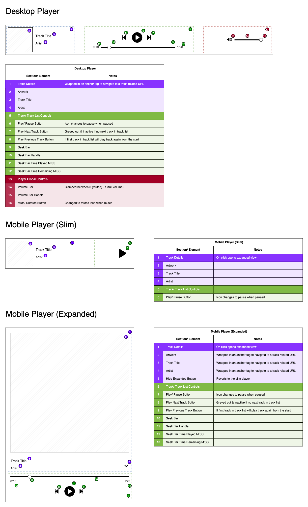

# React Audio Player

- [Components](https://jonnypickard.github.io/react-audio-player/storybook/?path=/docs/react-audio-player-overview-links--docs)
- [Player model API reference](https://jonnypickard.github.io/react-audio-player/typedoc/index.html)
- (WIP) Demo: [React Audio Player](https://jonnypickard.github.io/react-audio-player)

## About

Having written an audio player in the past, under strict time constraints, I wanted to see if I can make a better one.

I will potentially end up open-sourcing this, as there seems to be a need for something along these lines.

## TODO

- [ ] **API** - Create the underlying logic required for a UI to function.
  - [x] Create basic OO class structure for the player.
    - [x] Logical grouping of player elements
    - [x] Add basic tests.
  - [x] Add some api documentation/ TSDOC autogenerate API spec.
    - [x] [typedoc](https://typedoc.org/)
  - [ ] Add more error logging to make it more obvious what issues are.
  - [x] UI Designs/ Blueprints to check all required logic exists.
- [ ] **Repo/ Docs/ Demos/ Publishing**
  - [x] Create basic static pages site w/ cd pipeline to host the api documentation, designs & player demo.
  - [x] Add steps to build + deploy the storybook library to the GH pages site.
  - [ ] Optimise output to publish to NPM. Potentially also split out player API if users want to create their own GUI's for it.
- [ ] **Frontend**
  - [x] Setup/ create theme solution + design tokens.
  - [x] Customizable icon solution.
  - [ ] Components (First Pass)
    - [ ] Atoms
      - [x] Icon
      - [ ] Image \*
      - [ ] Text \*
      - [ ] Link \*
      - [ ] Timestamp \*
    - [ ] Molecules
      - [x] IconButton (w/ Tooltip)
      - [ ] Slider
      - [ ] Track Details
      - [ ] Track Controls
        - [ ] Playback Controls
        - [ ] Seek Bar
      - [ ] Player Global Controls
        - [ ] Volume Bar
    - [ ] Organisms (Player)

\* don't think its worth remaking

## Wireframes

<p align="center">
  
</p>

## Generate Type Docs

```sh
  npm run documentation:generate
```

Runs [typedoc](https://typedoc.org/) against the Player model code.

```sh
  npm run documentation:open
```

Opens `docs/typedoc/index.html` to see the generated API documentation.

## Dependency Choices

### Chakra UI - Component Library

Instead of manually creating specific components with all required features as a first pass I've decided to use Chakra UI.

The main benefits of Chakra are significant time-saved. And the ability to handle all of the UI-related requirements without having to install multiple dependencies. Finally, it has rich accessibility features built in.
