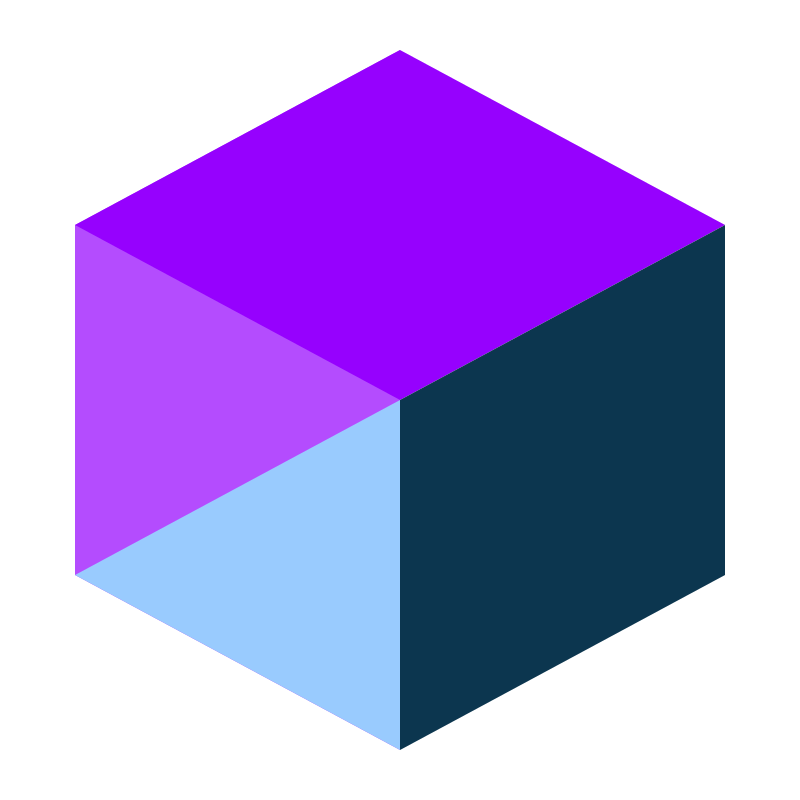

<p align="center">
  <a href="https://jonnypickard.github.io/react-audio-player/storybook/?path=/docs/react-audio-player-overview-links--docs">
    <picture>
      
    </picture>
  </a>
</p>

<p align="center">Web/ HTML5 Audio Player Written In React</p>

## Demo Links

- 🎨 [Components](https://jonnypickard.github.io/react-audio-player/storybook/?path=/docs/react-audio-player-overview-links--docs)
- <a href="https://jonnypickard.github.io/react-audio-player/typedoc/index.html">
    <picture>
      
      Player model reference
    </picture>
  </a>
- 🚧 (WIP) Demo: [React Audio Player](https://jonnypickard.github.io/react-audio-player)

## About

Having written an audio player in the past, under strict time constraints, I wanted to see if I can make a better one.

I will potentially end up open-sourcing this.

Apologies in advance for the test tracks included. They are tracks I made ~10 years ago.

## Testing

Currently [vitest](https://vitest.dev/) with [react testing library](https://testing-library.com/docs/react-testing-library/intro/) is set up for unit tests.

```sh
# run unit tests

npm test
```

```sh
# run unit tests with coverage

npm run test:coverage
```

Then [Chromatic](#chromatic-by-storybook---hosting--component-explorer) can be used to do visual regression tests on components.

> Note: Because I still need to work out centralised state management from the player -> components. I'm holding off on RTL tests for now as i'd probably just end up having to re-write them.

## Designs

### Desktop Player


### Mobile Player - Slim


### Mobile Player - Expanded


## Generate Type Docs

```sh
  npm run documentation:generate
```

Runs [typedoc](https://typedoc.org/) against the Player model code.

```sh
  npm run documentation:open
```

Opens `docs/typedoc/index.html` to see the generated API documentation.

## Dependency Choices

### Chakra UI - Component Library

Instead of manually creating specific components with all required features as a first pass I've decided to use Chakra UI.

The main benefits of Chakra are significant time-saved. And the ability to handle all of the UI-related requirements without having to install multiple dependencies. Finally, it has rich accessibility features built in.

### [Chromatic By Storybook](https://www.chromatic.com/) - Hosting + Component Explorer

I wanted to try this with figma integration to see how it works.

To deploy you need an `.env` file at root containing:

```sh
CHROMATIC_PROJECT_TOKEN='<project token>'
```

Then run the script to build and deploy storybook with:

```sh
npm run chromatic:deploy
```

## TODO

- [ ] **API** - Create the underlying logic required for a UI to function.
  - [x] Create basic OO class structure for the player.
    - [x] Logical grouping of player elements
    - [x] Add basic tests.
  - [x] Add some api documentation/ TSDOC autogenerate API spec.
    - [x] [typedoc](https://typedoc.org/)
  - [ ] Add more error logging to make it more obvious what issues are.
  - [x] UI Designs/ Blueprints to check all required logic exists.
- [ ] **Repo/ Docs/ Demos/ Publishing**
  - [x] Create basic static pages site w/ cd pipeline to host the api documentation, designs & player demo.
  - [x] Add steps to build + deploy the storybook library to the GH pages site.
  - [ ] Optimise output to publish to NPM. Potentially also split out player API if users want to create their own GUI's for it.
  - [ ] Maybe switch Chakra storybook plugin for [custom theme decorator.](https://github.com/chakra-ui/chakra-ui/issues/6855#issuecomment-1284552528) - Because initially the player is dark mode only & light mode changes colors.
- [ ] **Frontend**
  - [x] Setup/ create theme solution + design tokens.
  - [x] Customizable icon solution.
  - [x] Component designs - Figma
  - [ ] Link more component designs to storybook?
  - [ ] Components (First pass)
    - [ ] Atoms
      - [x] Icon
      - [ ] Image \*
      - [ ] Text \*
      - [ ] Link \*
      - [ ] Timestamp
        - [x] Basic component
        - [ ] Work out how to subscribe it to duration/ seek times etc
    - [ ] Molecules
      - [x] IconButton (w/ Tooltip)
      - [x] Slider
      - [ ] Track Details
        - [x] Rework artist -> artists incase there are multiple, with links to their pages.
        - [ ] Text roll animation if title/ artist name are too long and go off screen.
          - Will need to calculate visible space + text length
      - [ ] Track Controls
        - [x] Playback Controls
        - [x] Seek Bar
      - [ ] Player Global Controls
        - [x] Volume Bar
    - [ ] Organisms (Player)

\* don't think its worth remaking

## Wireframes

  
